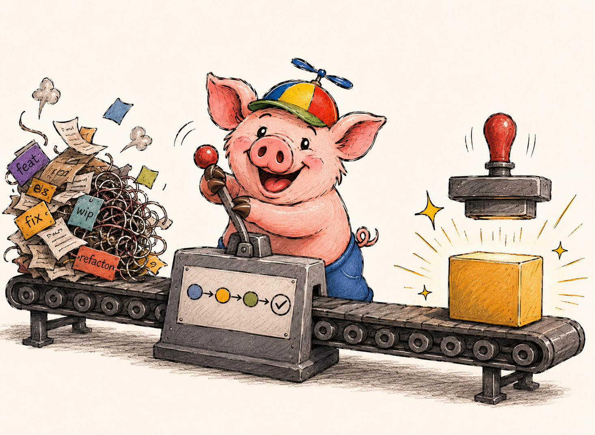

# Development Workflow

<p align="center">
  
</p>

To support a reliable release pipeline, the development workflow should follow several conventions.

## Task Management

Every feature or fix should be associated with a clearly defined task in the project backlog.

Each task should include:

- description
- acceptance criteria
- issue identifier (e.g. Jira ticket)

## Git Flow

The project follows a simplified Git Flow approach.

Typical workflow:

```text
feature branch → pull request → code review → merge to dev/stage
```

### Branch Naming Convention

Branches follow a predictable naming format:

```shell
feat/XXXX-short-description
```

Where:

- feat indicates the type of change
- XXXX references the task ID (e.g. Jira ticket)
- short-description briefly explains the change

Example:

```shell
feat/1023-user-authentication
```

This makes it easier to trace changes back to project tasks.

### Commit Conventions

Commit messages follow commitlint / conventional commit standards.

This improves readability and allows automatic changelog generation.

Example:

```text
feat(auth): add JWT authentication
fix(api): handle missing query parameters
```

## Feature Workflow

1. Create a feature branch
2. Implement the change
3. Open a pull request
4. Pass code review
5. Rebase on `main`
6. Merge into `main`
7. Send the task to testing

## Bug Fixing Workflow

If a defect is discovered:

1. Create a bugfix branch

```shell
fix/123-fix-null-pointer
```

2. Implement the fix
3. Open a pull request
4. Pass code review
5. Merge after approval

## Code Review

Code review is **mandatory for all changes**.

This applies to:

- features
- bug fixes
- refactoring
- infrastructure changes

Consistent branch naming also makes it easy to analyze sprint results and track how issues were resolved.

## Squash Merge Strategy

In this project we use a **hybrid merge strategy** that combines the advantages of both **rebase** and **merge**.

The goal is to keep the `main` branch:

- clean
- linear
- easy to read
- suitable for automated changelog generation

With this approach, all commits from a feature branch are combined into **a single commit** before being added to
`main`.

This preserves a clean project history while still allowing developers to work with multiple commits inside feature
branches.

How to automate this in Github:

> - Open the repository on GitHub.
> - Go to Settings → General.
> - Scroll down to the Pull Requests section.
> - In the Merge button section, disable any unnecessary options:
> - Leave only Allow squash merging enabled.
> - Disable Allow merge commits and Allow rebase merging if you want to prevent other merge types.

## Squash Merge Workflow

Follow the same steps used in a rebase workflow during development:

1. Create a feature branch
2. Implement the feature with multiple commits if needed
3. Rebase the branch on top of the latest `main`

Once the feature is ready to be merged, switch back to the `main` branch and run:

```shell
git merge --squash feat/123-add-user-endpoint
```

This command prepares the merge but **does not create a commit automatically**.

Next, create a single commit that represents the entire feature:

```shell
git commit -m "feat: <some description here>"
```

As a result:

- the full history of the feature branch is compressed into **one commit**
- the `main` branch remains **linear**
- the commit history stays **easy to understand**

## NX-Aware Development

This monorepo uses NX for task orchestration. Prefer `nx affected` over running everything when working on a specific
package — it runs only the tasks affected by your changes based on the dependency graph.

```shell
# Run tests only for packages affected by current changes
npx nx affected -t test

# Run lint only for affected packages
npx nx affected -t lint

# See which projects are affected
npx nx affected:graph
```

This significantly reduces feedback time during development and is especially important in CI.

## Why this matters

A clean and structured commit history becomes extremely valuable when the project grows.

This approach allows us to:

- generate **automated changelogs**
- simplify release notes
- make code history easier to navigate
- clearly see which commits introduced specific features

The more **atomic and structured** the commits in the `main` branch are, the easier it becomes to manage releases and
maintain the project over time.
